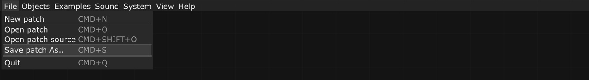
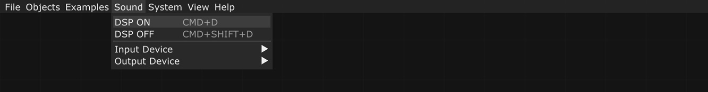

# Menu

Mosaic's interface has a top menu with the options: **File**, **Objects**, **Examples**, **Sound**, **System**, **View** and **Help**.

The **File** menu allows you to manage the Patches (.xml format Mosaic files) with the options to generate a new one: **New patch**, open a previously saved one: **Open Patch**, open the xml code of a patch in a code editor: **Open Patch source**, or save the current file: **Save Patch As**. Finally **Quit** closes Mosaic.

Patches are only saved once, and as you work on them the file will be saved automatically so you don't have to save it again when you finish your work.

In the **Objects** menu are the objects organized by type: audio analysis, communications, computer vision, data, graphics, gui, logic, math, scripting, sound, video, and windowing. This object menu also appears anywhere on the canvas when you right-click on it.

In the examples menu, the examples are organized by type:

The option **Livecoding** contains examples of bash, glsl (shaders), lua, processing and python files. When you select one of the examples, a scripting object appears in the canvas with the file already loaded.

The **Livepatching** option contains a template that must be used for Mosaic to communicate with pure data.

If you select an example from the **Visual programming** option, Mosaic will open the patch for the selected example.

The **Sound** menu allows you to configure the sound system: in **Input Device**, select the audio input device of your computer, and in **Output Device**, select the output device. After that you need to activate **DSP ON**, and the object **audio device** appears on the canvas, it is a Mosaic system object, which means that it can't be added/deleted like the other objects, and it establishes a direct connection with the computer audio device  selected.

If you click on **DSP OFF**, the **Audio Device** object does not disappear, but remains inactive, you can see in the Mosaic bottom bar  DSP OFF in grey, and when you activate it DSP ON in orange.

In the System menu, the first option **FPS**, allows you to select the number of frames per second you want for the Patch.

**Screenshot** allows you to save a Patch image.

In the View menu, if **Code Editor** is activated, a code editor is opened on Mosaic's right side to program the files linked to the scripting objects.

If you select **Profiler** ([profiling](https://en.wikipedia.org/wiki/Profiling_(computer_programming))), a table will be displayed in the lower right part of Mosaic that indicates the times that the system takes to execute each of the objects. This allows you to know in real time if any object is being used or configured in a wrong way, when the processing time is high, that is to say, it allows you to detect problematic points in the patch. Once the results have been analyzed, disable it to reduce processing.

If you activate **Logger**, Mosaic opens the output console at the bottom of the interface. This console informs you about the connected devices specifications, and also points out in red the problems, for example, if when you work with scripting files you make an error, the logger indicates the line number where the problem is.

Through the Help menu options you can access to the Mosaic web page in Github, to the Reference page in  Mosaic web -where the objects are described-, to the openFrameworks documentation page, or to the openFrameworks official Addons page.

