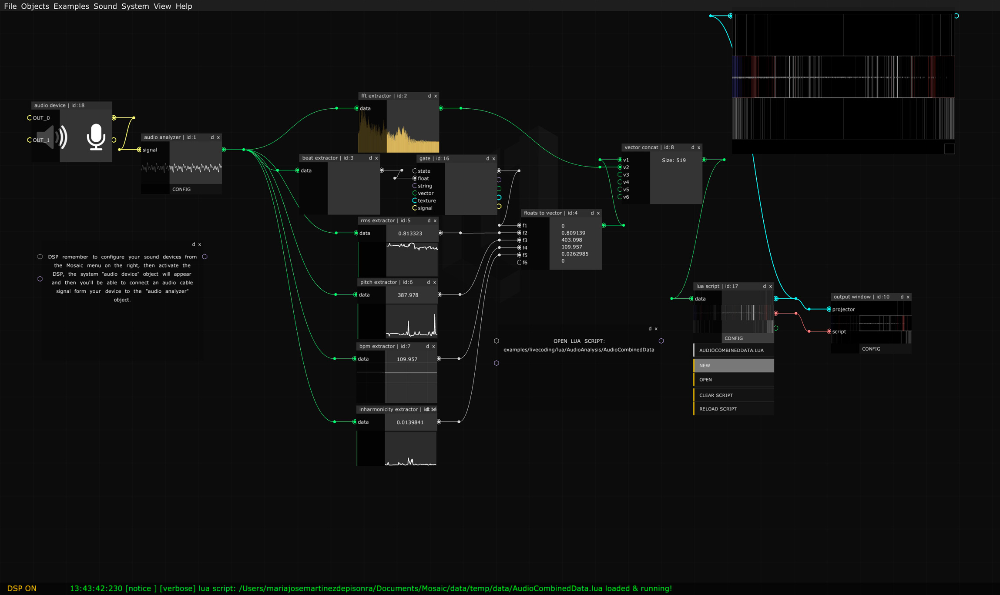

# Quick Start

[Mosaic](https://mosaic.d3cod3.org/) es un entorno de programación visual y live coding, basado en [openFrameworks](https://openframeworks.cc/) 0.10.0, es open-source y, aunque es multiplataforma (OSX, Linux y  Windows) parece más lógico que las aplicaciones open source se utilicen  en sistemas operativos también open source.

#### Especificaciones

```
- multiplataforma (hasta que Apple y Microsoft decidan eliminar el soporte para openGL, entonces será sólo Linux)
- multi-threaded
- non-blocking system dialogs
- internal code editor
- lua/python/processing/glsl/bash live-coding
- pure data live-patching
- non-linear interactive timeline
- warping integrado en el objeto output window
- map-map style integrado en el módulo mapping
```

------

Después de instalar Mosaic (ver [instalación](Installing.html))  al abrirlo verás el menú superior y el espacio de trabajo (canvas) donde se situarán los objetos.



Para añadir un objeto, clica  el botón derecho del ratón sobre el espacio vacío del canvas y aparecerá el menú de objetos ordenados por categorías, si seleccionas un objeto, se situará en el canvas. Desde el menú superior **Objects** puedes seleccionarlo igualmente.

Se puede mover un objeto arrastrándolo con el ratón al lugar deseado. Se pueden desplazar todos los objetos de un patch clicando en un espacio vacío del canvas y arrastrándolo. Con el scroll del ratón se hace  zoom de aumento o reducción de todo lo que hay en el canvas.

La mayoría de los objetos tienen conectores, en su lado izquierdo están los inlets y en el derecho los outlets. Al arrastrar el ratón desde un outlet veremos como se estira un cable, y a su lado se nos indica el tipo de datos que transmite y el nombre del outlet. Al acercar el cable a su destino, el inlet aumenta de tamaño si es del mismo tipo de datos que transmite el cable, si es de otro tipo de datos no se puede conectar.

Hay seis tipos de datos que se pueden comunicar entre los objetos y cada uno de los cables que los transmiten, así como sus inlets y outles se identifican por su color:

| **Tipo conexión** | **Tipo variable** | **Color** |
| ----------------- | ----------------- | --------- |
| ----------------- | ----------------- | --------- |
| Numeric         | float             | **<span style="color:rgb(210,210,210)">Gris</span>**  |
| Text		        | string            | **<span style="color:rgb(200,180,255)">Violeta</span>** |
| Array             | vector<float\>    | **<span style="color:rgb(120,255,120)">Verde</span>** |
| Texture                             | ofTexture                          | **<span style="color:rgb(120,255,255)">Azul</span>**              |
| Pixels                             | ofPixels                          | **<span style="color:rgb(0,180,140)">Verde Esmeralda</span>**              |
| Sound                              | ofSoundBuffer                 | **<span style="color:rgb(255,255,120)">Amarillo</span>**    |
| Live Coding                       | Mouse/Keyboard Interaction        | **<span style="color:rgb(255,128,128)">Rojo</span>**               |

[](https://vimeo.com/394048806)
